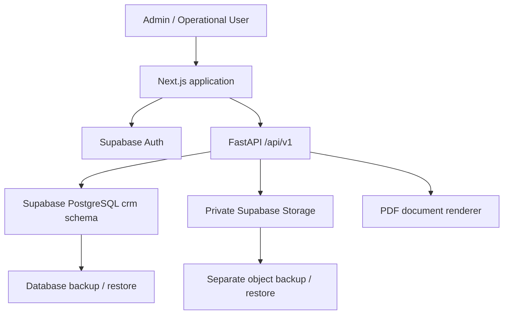
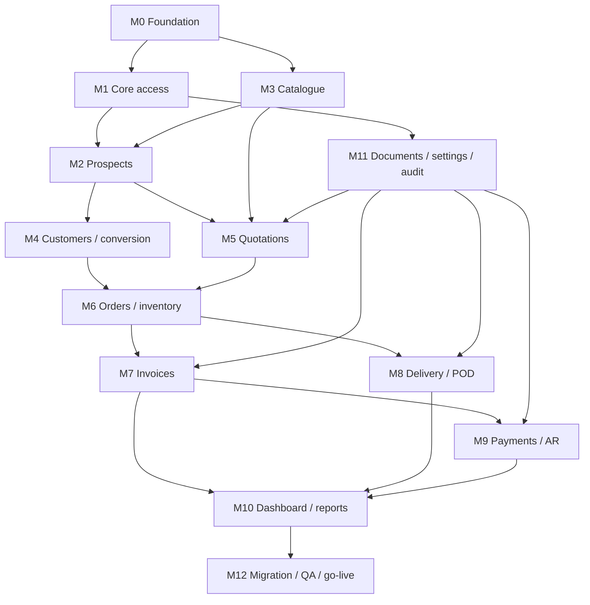
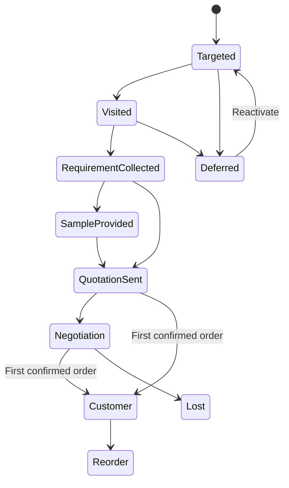

# MPSTT CRM - Module-Wise Graph Structural Build Prompt

**Prepared for:** Medical Prism Supplies for Treatment and Technology (MPSTT)  
**Research and architecture review date:** 26 August 2026  
**Source baseline:** *MPSTT CRM Implementation Planning Blueprint v1.2*, 23 August 2026  
**Product boundary:** A focused prospect-to-payment CRM for medical safety, healthcare-waste, and related institutional supplies. It is not a hospital clinical system and must not collect patient data.

---

## 1. How to use this document

Use the **Master Build Prompt** once to give an AI coding agent the complete product context. Then give the agent one **module prompt** at a time in dependency order. Do not ask the agent to build the whole CRM in a single uncontrolled pass.

The coding agent must treat every module as a graph node with:

- explicit dependencies;
- database migrations;
- API contracts and server-side business rules;
- frontend pages, components, and states;
- security and audit requirements;
- automated tests and an exit gate.

No node is complete merely because its UI is visible. It is complete only when the schema, backend, frontend, permissions, audit behavior, tests, and acceptance criteria all pass.

---

## 2. Researched architecture decisions

### 2.1 Final technology stack

| Layer | Technology | Final responsibility |
|---|---|---|
| Frontend | Next.js App Router, TypeScript | Responsive application UI, routing, forms, tables, protected pages, API integration |
| UI system | Tailwind CSS, shadcn/ui, Lucide icons | Accessible MPSTT-branded components |
| Forms | React Hook Form + Zod | Client-side form experience; server validation remains authoritative |
| Server state | TanStack Query | Caching, invalidation, pagination, optimistic UX only where safe |
| API | FastAPI + Pydantic v2 | Authorization, validation, workflow orchestration, idempotency, PDFs, signed file access |
| Data layer | SQLAlchemy 2 async + asyncpg | Repository queries and transactional units of work |
| Database | Supabase PostgreSQL | Relational source of truth, constraints, views, indexes, migrations |
| Authentication | Supabase Auth | User identity, password/session handling, optional TOTP MFA |
| Application authorization | FastAPI + `crm.user_profiles` | `admin` and `user` permissions; backend verifies Supabase JWT |
| Storage | Private Supabase Storage buckets | POs, quotations, invoices, challans, PODs, receipts, payment proofs |
| Migrations | Alembic | The only production schema-change path after the baseline |
| PDFs | Jinja2 HTML templates + WeasyPrint | Branded quotation, invoice, challan, receipt PDFs from frozen server data |
| Testing | pytest, pytest-asyncio, HTTPX, pgTAP, Playwright | Unit, DB, API, integration, permissions, E2E, and PDF checks |
| Deployment | Docker + HTTPS | Separate frontend and backend services; managed Supabase database/storage |

### 2.2 Security correction to the original blueprint

Do **not** create a CRM password table or store `password_hash` in `crm.users`. Use Supabase Auth as the identity provider and create `crm.user_profiles` with `id uuid primary key references auth.users(id)`, `full_name`, `role`, `is_active`, and timestamps.

Apply these rules:

1. Use `@supabase/ssr` for Next.js session cookies.
2. FastAPI verifies the Supabase access token against the project's JWKS and checks `crm.user_profiles` on every protected request.
3. Require `aal2`/TOTP MFA for the Admin in production. The Operational User may start at `aal1` if MPSTT accepts the risk.
4. The browser calls FastAPI for CRM data. It must not write directly to `crm.*` tables.
5. Do not expose the `crm` schema through the Supabase Data API unless a reviewed use case requires it.
6. Use a least-privileged database role for FastAPI. Do not use the database owner for normal runtime queries.
7. Never expose a Supabase secret/service-role key in browser code. Public/publishable keys may be used only for the supported Auth flow.
8. Keep all business-document Storage buckets private. Upload through FastAPI or a tightly scoped signed-upload flow; download through short-lived signed URLs after authorization.
9. Database backup and Storage backup are separate operational controls. A database restore alone does not restore deleted Storage objects.

### 2.3 Healthcare-supply data design

MPSTT sells to institutional customers, so the catalogue must support product specifications without hard-coding one category. A product variant may include validated structured attributes such as:

- size/dimensions;
- thickness or GSM;
- material and composition;
- colour;
- capacity/load rating;
- roll length or quantity per pack/carton;
- intended waste category/use;
- labelling or symbol requirements;
- manufacturer/brand and country of origin;
- relevant certificate/document references;
- lot/expiry tracking mode when applicable.

Store common commercial fields relationally and category-specific specifications in validated `jsonb`. Do not let users enter arbitrary unvalidated keys: maintain a category attribute-definition schema.

WHO guidance and Pakistan's Hospital Waste Management Rules support segregation, identification, and recordkeeping in healthcare-waste workflows. The CRM should therefore preserve product specifications and compliance-document references. However, do not hard-code an AI-generated colour rule as law. MPSTT's Quality/Legal owner must approve the exact current federal/provincial mapping used for each sellable item.

---

## 3. Frozen product rules

1. An organization is a **Prospect** until its first confirmed order.
2. First-order conversion updates the same organization record to **Customer**; it never duplicates the organization.
3. Conversion preserves all contacts, branches, activities, requirements, samples, quotations, prices, and documents.
4. An active prospect without a next action is visible as an exception.
5. Sent quotations are immutable snapshots. Revision creates a new linked revision.
6. An order may originate from an accepted quotation or a direct customer PO.
7. The first order from a prospect converts it to Customer in the same transaction.
8. Confirming an order reserves available stock at line level.
9. Available stock equals `on_hand - reserved` and must never be negative.
10. Invoice answers **what is owed**. Delivery/POD answers **what was physically delivered and received**. These are separate records.
11. An order may have multiple deliveries.
12. A delivery cannot exceed remaining ordered quantity.
13. An order cannot become fully delivered until all required quantities are complete and the POD gate is satisfied.
14. One payment may be allocated to multiple invoices; one invoice may receive multiple payments.
15. Outstanding equals invoice total minus valid, non-reversed allocations.
16. Overdue is calculated from the actual invoice due date.
17. Issued/confirmed/financial records are cancelled or reversed with a reason; they are not silently deleted.
18. All money is `numeric(14,2)`; all quantities are `numeric(14,3)`; no floating-point currency.
19. Store timestamps as `timestamptz`; display in `Asia/Karachi`.
20. Server calculations, status transitions, numbering, stock, invoice balances, and PDF snapshots are authoritative.
21. Important mutations write an append-only audit record in the same transaction.
22. No patient or clinical information is required or permitted.

---

## 4. System graph



### Responsibility boundary

- Next.js owns presentation and user interaction.
- Supabase Auth owns identity and sessions.
- FastAPI owns authorization and commercial workflows.
- PostgreSQL owns data integrity and relational truth.
- Storage owns file bytes; `crm.documents` owns searchable metadata and entity links.
- PDF generation uses frozen transactional snapshots, never editable browser totals.

---

## 5. Module dependency graph



### Recommended execution order

1. M0 Foundation
2. M1 Core access, auth, roles, numbering
3. M3 Catalogue and pricing foundation
4. M2 Prospects and field sales
5. M4 Customers and atomic first-order conversion
6. M11 Documents, company settings, audit foundation
7. M5 Quotations and branded PDF
8. M6 Orders and inventory
9. M7 Billing and invoices
10. M8 Delivery, challan, and POD
11. M9 Payments and receivables
12. M10 Dashboard and reports
13. M12 Migration, UAT, backup/restore, go-live

---

## 6. Commercial lifecycle state graph



The UI may allow a justified stage skip, but the backend must still capture the required evidence for the resulting stage. `Won` is not a manually editable prospect status; it is produced only by successful first-order conversion.

---

## 7. Domain-level ERD graph

```mermaid
erDiagram
    AUTH_USERS ||--|| USER_PROFILES : has
    ORGANIZATIONS ||--o{ BRANCHES : owns
    ORGANIZATIONS ||--o{ CONTACTS : has
    ORGANIZATIONS ||--o| PROSPECT_PROFILES : has
    ORGANIZATIONS ||--o| CUSTOMER_PROFILES : gains
    ORGANIZATIONS ||--o{ ACTIVITIES : records
    ORGANIZATIONS ||--o{ TASKS : schedules
    ORGANIZATIONS ||--o{ PRODUCT_PROFILES : needs
    ORGANIZATIONS ||--o{ SAMPLES : receives
    PRODUCT_CATEGORIES ||--o{ PRODUCTS : groups
    BRANDS ||--o{ PRODUCTS : brands
    PRODUCTS ||--o{ PRODUCT_VARIANTS : offers
    ORGANIZATIONS ||--o{ ORGANIZATION_PRICES : receives
    ORGANIZATIONS ||--o{ QUOTATIONS : receives
    QUOTATIONS ||--|{ QUOTATION_ITEMS : contains
    ORGANIZATIONS ||--o{ SALES_ORDERS : places
    SALES_ORDERS ||--|{ SALES_ORDER_ITEMS : contains
    WAREHOUSES ||--o{ STOCK_BALANCES : holds
    SALES_ORDER_ITEMS ||--o{ STOCK_RESERVATIONS : reserves
    PRODUCT_VARIANTS ||--o{ STOCK_MOVEMENTS : moves
    SALES_ORDERS ||--o{ INVOICES : bills
    INVOICES ||--|{ INVOICE_ITEMS : contains
    SALES_ORDERS ||--o{ DELIVERIES : fulfills
    DELIVERIES ||--|{ DELIVERY_ITEMS : contains
    DELIVERIES ||--o| PROOF_OF_DELIVERY : proves
    ORGANIZATIONS ||--o{ PAYMENTS : makes
    PAYMENTS ||--o{ PAYMENT_ALLOCATIONS : allocates
    INVOICES ||--o{ PAYMENT_ALLOCATIONS : receives
    PAYMENTS ||--o| RECEIPTS : produces
    ORGANIZATIONS ||--o{ DOCUMENTS : links
```



---

## 8. Supabase PostgreSQL structure

### 8.1 Database conventions

- Enable `pgcrypto` and use `gen_random_uuid()`.
- Put application tables, views, and functions in schema `crm`.
- Use `snake_case` table and column names.
- Main entities use UUID PKs; high-volume audit/events may use `bigint generated always as identity`.
- Every mutable root has `created_at`, `updated_at`, `created_by`, `updated_by`, and `version integer not null default 1` where optimistic concurrency matters.
- Add stable human document numbers separately from UUIDs.
- Master data uses `is_active`; referenced history is not hard-deleted.
- Transaction tables use controlled cancel/reversal states.
- Statuses use PostgreSQL check constraints or controlled lookup tables; do not accept unrestricted status text.
- Add `deleted_at` only where soft deletion has a clear business meaning. Do not use soft deletion as a substitute for cancellation.
- Use database transactions and acquire row locks in a consistent order for numbering, stock, conversion, delivery, and payment allocation.

### 8.2 Table groups

#### Access and shared controls

1. `crm.user_profiles`
   - `id uuid PK FK auth.users(id)`
   - `full_name varchar(150)`
   - `role varchar(20) check (role in ('admin','user'))`
   - `is_active boolean default true`
   - `last_login_at timestamptz`
   - timestamps

2. `crm.company_settings`
   - company/legal name, phone, email, website, NTN/STRN or applicable identifiers
   - address and bank/payment details
   - default currency `PKR`, timezone `Asia/Karachi`, payment terms
   - logo/document footer paths

3. `crm.number_sequences`
   - `document_type`, prefix, year, next value, padding
   - unique `(document_type, year)`
   - allocate inside a row-locked transaction; never calculate using `MAX(number)+1`

4. `crm.documents`
   - `organization_id nullable`, `entity_type`, `entity_id`, `document_type`
   - `bucket`, `storage_path`, original filename, MIME type, size, checksum
   - `uploaded_by`, `created_at`, optional retention label
   - do not store permanent public URLs

5. `crm.audit_log`
   - user, action, entity type/id, old/new JSON, reason, request ID, IP, timestamp
   - append-only; no ordinary user update/delete permission

6. `crm.idempotency_keys`
   - user, route/action, key, request hash, response status/body reference, expiry
   - unique `(user_id, action, idempotency_key)`
   - required for high-impact POST actions

#### Organization and field sales

7. `crm.organizations`
   - organization code, legal/trading name, type, lifecycle status
   - city, source, tax identifiers when needed
   - `converted_at`, active state, ownership/audit fields

8. `crm.organization_branches`
   - branch name, area, city, delivery/billing addresses, map URL, route cluster
   - primary/active flags

9. `crm.organization_contacts`
   - branch optional, full name, designation, department
   - primary/alternate phone, WhatsApp, email, preferred channel
   - primary/active flags

10. `crm.prospect_profiles`
    - one-to-one organization
    - stage, assigned user, first contact, last activity, next action summary
    - lost/deferred reason and reactivation date
    - retained after conversion for history

11. `crm.customer_profiles`
    - one-to-one organization, created only at conversion
    - customer code, customer since, payment terms, optional credit limit
    - purchasing/billing notes and account status

12. `crm.activities`
    - visit/call/WhatsApp/email/meeting/follow-up
    - happened at, contact, outcome, notes, created by

13. `crm.tasks`
    - assigned user, organization, linked entity optional
    - type, due date/time, priority, status, completion outcome
    - use this for the action queue; do not repeatedly overwrite history in `prospect_profiles`

14. `crm.organization_product_profiles`
    - product/variant, frequency, minimum/maximum consumption, UOM
    - current supplier/rate, specification, notes, active flag

15. `crm.samples`
    - organization, product/variant, quantity/UOM, issue date, receiver
    - feedback due, status, feedback, source document/photo links

#### Catalogue and pricing

16. `crm.product_categories`
    - name, description, active flag
    - `attribute_schema jsonb` defining allowed variant specification keys

17. `crm.brands`
    - name, manufacturer details optional, active flag

18. `crm.units_of_measure`
    - code, name, category, decimal scale, active flag

19. `crm.products`
    - SKU, category, brand, product name, base UOM, description
    - tax rate, lot tracking mode (`none`, `lot`, `lot_expiry`), active flag

20. `crm.product_variants`
    - product, variant code, variant name, UOM
    - validated `attributes jsonb`
    - unique `(product_id, variant_name)` and unique variant code

21. `crm.organization_prices`
    - organization, product/variant, price type, unit price, UOM
    - effective from/to, source reference, creator
    - preserve history; never overwrite an expired/previous rate

#### Quotations and orders

22. `crm.quotations`
    - quotation number, organization, branch/contact
    - revision number and parent quotation
    - dates, status, terms, server-calculated totals
    - frozen PDF document ID after send

23. `crm.quotation_items`
    - product/variant references plus description/specification snapshot
    - quantity, UOM, rate, discount, tax, line total, sort order

24. `crm.sales_orders`
    - order number, organization, branch, source quotation optional
    - direct-order flag, customer PO fields and document
    - order/expected dates, status, totals, notes

25. `crm.sales_order_items`
    - product/variant plus frozen description/specification
    - ordered quantity, rate, discount, tax, total
    - delivered quantity is derived from valid delivery items, not manually typed

#### Inventory and delivery

26. `crm.warehouses`
    - warehouse code/name/address, active flag

27. `crm.stock_balances`
    - PK `(warehouse_id, product_variant_id)`
    - on hand, reserved, version, updated timestamp
    - checks: on hand >= 0, reserved >= 0, reserved <= on hand unless an Admin-approved backorder policy is later introduced

28. `crm.stock_reservations`
    - sales-order item, warehouse, variant, reserved quantity, status
    - created/released/fulfilled timestamps

29. `crm.stock_movements`
    - warehouse, variant, signed quantity, movement type
    - reference type/id, notes, creator, movement timestamp
    - append-only except controlled reversal entry

30. `crm.deliveries`
    - challan number, order, organization, branch
    - scheduled/delivered timestamps, status, delivery person/vehicle
    - receiver fields and remarks

31. `crm.delivery_items`
    - delivery, order item, dispatched/delivered/rejected quantities
    - checks >= 0; transaction prevents delivery above remaining quantity

32. `crm.proof_of_delivery`
    - one-to-one delivery
    - receiver/designation/time
    - signature, signed challan, photo document references
    - optional latitude/longitude only after privacy and business approval

#### Billing and receivables

33. `crm.invoices`
    - invoice number, organization, sales order
    - invoice/due dates, payment terms, status
    - server-calculated subtotal, discount, tax, total
    - origin `system|migration`, issued timestamp, frozen PDF document

34. `crm.invoice_items`
    - invoice, optional order item, product/variant
    - frozen description, quantity/UOM/rate/discount/tax/line total

35. `crm.payments`
    - payment number, organization, date, amount, method, reference
    - proof document, status, notes, creator

36. `crm.payment_allocations`
    - payment, invoice, allocated amount, creator, timestamp
    - unique `(payment_id, invoice_id)` unless allocation versioning is used
    - allocation total cannot exceed payment balance or invoice outstanding

37. `crm.receipts`
    - receipt number, one-to-one payment, issued timestamp, PDF document, creator

### 8.3 Required views

- `crm.v_stock_available`: on hand, reserved, and available per warehouse/variant.
- `crm.v_order_delivery_progress`: ordered, delivered, rejected, and remaining per order item.
- `crm.v_invoice_balances`: invoice total, allocated, outstanding, and derived payment status.
- `crm.v_receivables_aging`: open invoices with days overdue and 0-30, 31-60, 61-90, 90+ buckets.
- `crm.v_prospect_action_queue`: open prospects, next task, overdue flag, days since last activity.
- `crm.v_delivery_exceptions`: delayed orders, missing PODs, rejected quantities.
- `crm.v_customer_360_summary`: last order, order frequency, lifetime sales, outstanding, last activity.

### 8.4 Critical indexes and constraints

- Unique indexes on all business numbers, SKUs, and variant codes.
- Case-insensitive organization-name search using normalized name and/or `pg_trgm` where available.
- Phone indexes on normalized phone fields.
- Index all organization foreign keys and high-use status/date combinations.
- Index `tasks(assigned_user_id, status, due_at)`.
- Index `stock_movements(product_variant_id, warehouse_id, movement_at)`.
- Index `invoices(status, due_date)` and `deliveries(status, scheduled_date)`.
- Prevent quantity and amount values <= 0 where the business action requires positive values.
- Restrict deletion of transactional parents.
- Enforce storage/document reference integrity in the application and reconciliation jobs.

---

## 9. Master build prompt

Copy the following into the coding agent before sending individual module prompts:

> You are a principal software architect and senior full-stack engineer with at least 10 years of experience building secure B2B CRM, inventory, delivery, and receivables systems. Build the MPSTT prospect-to-payment CRM as a production-quality modular monorepo.
>
> Stack: Next.js App Router + TypeScript + Tailwind + shadcn/ui + React Hook Form + Zod + TanStack Query; FastAPI + Pydantic v2 + SQLAlchemy 2 async + asyncpg; Supabase PostgreSQL, Supabase Auth, and private Supabase Storage; Alembic migrations; Jinja2 + WeasyPrint PDFs; pytest/HTTPX/pgTAP/Playwright; Docker and HTTPS.
>
> Architecture: browser UI authenticates with Supabase Auth but all core CRM reads/writes go through `/api/v1` FastAPI. FastAPI verifies the Supabase JWT, loads `crm.user_profiles`, and enforces `admin|user`. Never expose database credentials or Supabase secret/service keys to the browser. Keep the `crm` schema unexposed to the Data API unless explicitly approved. Use a least-privileged runtime DB role. Storage buckets are private and files are referenced through `crm.documents`.
>
> Business scope: MPSTT sells medical safety, healthcare-waste, and related supplies to hospitals and institutional customers. Do not collect patient/clinical data. An organization remains a Prospect until its first confirmed order. The first-order transaction converts the same organization record into a Customer and preserves the full history. The lifecycle is Target -> Visit -> Requirement/Consumption -> Sample -> Quotation -> Follow-up/Negotiation -> First Order -> Customer -> Invoice -> Delivery/Challan/POD -> Payment -> Reorder.
>
> Engineering method: execute the supplied module dependency graph one node at a time. Before implementing a node, inspect the current repository and report existing files, migrations, tests, and conflicts. Create a short implementation checklist. Then implement database migration, models, repositories, services, routers, schemas, frontend pages/components/hooks/types, audit/authorization, and tests. Use Router -> Service -> Repository. Cross-module workflows belong in services and execute atomically. Do not put business transitions in routers or React components.
>
> Integrity rules: server calculates totals and statuses; use `numeric`, never float, for money/quantities. Use stable UUIDs plus unique human document numbers. Use row locks in consistent order for number allocation, prospect conversion, stock, deliveries, and payment allocation. Add idempotency for high-impact POST actions. Sent/issued documents are snapshots and are cancelled/reversed, not overwritten or deleted. Return 409 for invalid transitions/concurrency conflicts, 422 for validation, 403 for authorization, and a consistent error envelope with `code`, `message`, `field_errors`, and `request_id`.
>
> UI: use the MPSTT visual system: Primary Sea Green `#087F74`, Deep Teal `#075E59`, Soft White `#F7FAF9`, Charcoal `#263238`, Mint `#7BCBB8`, Amber `#F2B705`, Error Red `#C84545`. Use Poppins or a compatible sans serif. Keep tables highly scannable. Every page needs loading, empty, error, success, validation, permission-denied, and responsive states. Use accessible labels, keyboard navigation, focus states, contrast, and confirmation dialogs for destructive/high-risk actions.
>
> Quality gate: no placeholders, mock APIs, TODO business logic, hard-coded IDs, secrets, or client-authoritative calculations. Generate OpenAPI docs. Add unit, DB, API, integration, permission, concurrency, and E2E tests appropriate to the module. Run migrations from an empty database, lint, typecheck, backend tests, frontend tests, and E2E tests. Stop after the current module, summarize changed files, commands run, test evidence, assumptions, and unresolved decisions. Do not start the next module until authorized.

---

## 10. Module-wise development prompts

## Module M0 - Repository and environment foundation

**Depends on:** None  
**Exit gate:** Local development starts with one command; CI validates both apps; empty database migrations apply successfully.

> Initialize the MPSTT CRM production monorepo.
>
> Create `frontend/`, `backend/`, `supabase/`, `infra/`, and `docs/`. Configure Next.js App Router with TypeScript strict mode, Tailwind, shadcn/ui, ESLint, Prettier, and the MPSTT design tokens. Configure FastAPI with Pydantic Settings, SQLAlchemy async sessions, Alembic, structured JSON logs, CORS allowlist, request IDs, health/readiness endpoints, and standardized errors.
>
> Add Dockerfiles, a local Docker Compose setup where appropriate, `.env.example` files containing names only, and startup documentation. Configure separate development, test, staging, and production settings. Validate required environment variables at startup. Never commit secrets.
>
> Add a baseline Alembic migration that creates the `crm` schema and required extensions. Add a least-privileged runtime-role SQL plan. Configure database SSL. Choose connection mode according to deployment: long-lived FastAPI container may use direct/session pooling; auto-scaling deployment uses Supavisor transaction pooling.
>
> Add CI jobs for frontend lint/typecheck/build, backend lint/typecheck/tests, Alembic migration test from empty DB, secret scanning, and dependency auditing. Add a `/health` liveness endpoint and `/ready` database check.
>
> Tests: environment validation, DB connectivity, migration up/down or repair notes, health/readiness behavior, CORS, error envelope, and frontend shell render.

## Module M1 - Authentication, profiles, roles, sessions, and numbering

**Depends on:** M0  
**Exit gate:** Admin and Operational User can sign in; disabled users are blocked; protected routes and APIs enforce roles; numbering is concurrency-safe.

> Implement Supabase Auth integration without a custom password table. Create `crm.user_profiles`, `company_settings`, `number_sequences`, `audit_log`, and `idempotency_keys` migrations.
>
> Next.js must use `@supabase/ssr` cookie-based sessions and protected route handling. FastAPI must verify access tokens using the Supabase JWKS, reject expired/invalid tokens, load the active user profile, and expose `GET /api/v1/auth/me`. Implement authorization dependencies for `admin` and `user`.
>
> Add Admin-only user invitation/profile activation/deactivation. Do not allow public signup. Require or provide a production gate for TOTP MFA on Admin sessions and check `aal2` on high-risk Admin actions.
>
> Implement concurrency-safe sequence allocation for ORG, CUST, QT, ORD, INV, DC, PAY, and RCP numbers. Use a database row lock and transaction, not `MAX()+1`. Add audit helpers and request IDs.
>
> UI: branded login, expired-session handling, logout, user menu, unauthorized page, Admin user-management screen, company settings stub.
>
> Tests: invalid/expired tokens, inactive user, user/admin authorization matrix, MFA enforcement gate, simultaneous number allocation uniqueness, audit append-only protection, and session-safe SSR behavior.

## Module M2 - Prospects and field-sales workflow

**Depends on:** M1 and M3 catalogue foundation  
**Exit gate:** Operational User can take a prospect from Targeted to quotation-ready while every active opportunity remains visible in an action queue.

> Implement organizations, branches, contacts, prospect profiles, activities, tasks, organization product profiles, samples, and their constraints/indexes.
>
> API endpoints:
> - `GET/POST /api/v1/prospects`
> - `GET/PATCH /api/v1/prospects/{organization_id}`
> - branch/contact CRUD nested under organization
> - `POST /prospects/{id}/activities`
> - `GET/POST/PATCH /prospects/{id}/tasks`
> - `PUT /prospects/{id}/product-profiles`
> - `POST /prospects/{id}/samples`
> - `PATCH /samples/{sample_id}/feedback`
>
> Use progressive data capture. Prospect creation requires only organization name, type, area/city, source, and contact/phone if available. First visit captures person met, products discussed, notes, and next action. Product requirements capture frequency, min/max quantity, UOM, current supplier/rate, and required specifications. Sample issue captures product/variant, quantity, receiver, feedback due date, and immutable issue history.
>
> Stage rules: Targeted, Visited, Requirement Collected, Sample Provided, Quotation Sent, Negotiation, Lost, Deferred. `Won` cannot be manually patched; only first-order conversion creates it. Active prospects without an open next task appear in an exception view.
>
> UI: prospect pipeline/list, saved filters, fast create, 360-degree profile, branch/contact tabs, activity timeline, requirement grid, sample tracker, task/follow-up queue, overdue badges, and quick actions.
>
> Tests: minimal create, progressive enrichment, stage guards, missing-next-action exception, sample feedback lifecycle, phone normalization, duplicate warning without auto-merge, role access, audit trail, pagination/search, and mobile form behavior.

## Module M3 - Product catalogue, specifications, UOM, and customer pricing

**Depends on:** M1  
**Exit gate:** Admin can define reusable products/variants, Operational User can select valid sellable variants, and historical customer prices remain traceable.

> Implement product categories, brands, units of measure, products, variants, organization product profiles, and organization price history.
>
> Add category-level `attribute_schema jsonb` to define allowed specification keys, types, units, required fields, and option lists. Validate variant attributes on the backend. Provide sensible templates for waste bags, rolls, containers, paper/tissue, cleaning chemicals, and safety supplies, but make them editable by Admin.
>
> Common waste-bag attributes may include colour, dimensions, thickness, material, capacity, pack quantity, intended use/waste category, labelling, and certificate references. Label these as product master data, not as a legal compliance determination.
>
> API endpoints: product/category/brand/UOM CRUD, product variant create/edit/deactivate, price list/history, organization-specific price create/expire, and product search/autocomplete.
>
> Rules: referenced products and prices deactivate/expire instead of delete; transaction items take description/specification/rate snapshots; effective price periods for the same organization/product/variant must not overlap unless explicitly versioned.
>
> UI: catalogue table/cards, product editor, dynamic variant attribute form, variant matrix, active/inactive filters, price history, and customer/prospect product requirement link.
>
> Tests: attribute schema validation, SKU/variant uniqueness, UOM consistency, price effective-date overlap, deactivation protection, snapshot behavior, search performance, and permission matrix.

## Module M4 - Customers and atomic first-order conversion

**Depends on:** M2, M3, and M1 numbering  
**Exit gate:** First order converts a prospect exactly once without losing or duplicating any history.

> Implement `crm.customer_profiles`, converted-customer views, customer search, customer 360 summary, and the atomic conversion service.
>
> Provide `GET /api/v1/customers`, `GET/PATCH /customers/{id}`, `GET /customers/{id}/timeline`, and `POST /prospects/{id}/convert-to-customer-order`.
>
> Conversion transaction must:
> 1. require an idempotency key;
> 2. lock the organization and number-sequence rows;
> 3. verify lifecycle is still Prospect;
> 4. validate a complete first order or accepted quotation conversion;
> 5. assign customer code and `converted_at`;
> 6. create `customer_profiles`;
> 7. set lifecycle to Customer;
> 8. close the prospect task/stage as Won;
> 9. create order and items;
> 10. optionally reserve stock if immediately confirmed;
> 11. write audit entries;
> 12. commit all or roll back all.
>
> UI: customers list, customer 360 with identity, branches, contacts, commercial profile, prospect history, requirements, quotations, orders, invoices, deliveries, payments, documents, outstanding, and reorder indicators.
>
> Tests: two simultaneous conversion attempts create one customer/order result; retry returns the idempotent response; history is preserved; customer-only screens exclude prospects; failed order validation rolls back conversion; customer deactivation does not delete history.

## Module M5 - Quotations, revisions, and branded PDFs

**Depends on:** M2, M3, M11 document/settings foundation  
**Exit gate:** A prospect/customer quotation can be drafted, sent as a branded immutable PDF, revised without overwriting history, accepted/rejected, and converted to an order.

> Implement quotation headers/items, revision chains, server-side calculations, status actions, and PDF rendering.
>
> Endpoints: list/create/detail, draft update, `POST /quotations/{id}/send`, `/revise`, `/accept`, `/reject`, `/convert-to-order`, and `GET /quotations/{id}/pdf`.
>
> Rules: only Draft is editable; Send freezes item descriptions/specifications, rates, terms, tax, totals, and generated PDF. Revision creates a new row with incremented revision number and parent link. Acceptance requires a sent/current revision. Expiry derives from `valid_until`. Quote-to-order copies snapshots and performs first-order conversion atomically if the organization is still a prospect.
>
> UI: quote list/status filters, builder with organization/contact/branch prefill, requirement-to-items action, line editor, totals summary, terms, revision history, PDF preview/download, and state-specific actions.
>
> PDF: MPSTT logo, company/customer details, quote number/revision/date/validity, structured item table, totals, terms, bank/contact/footer. Store the generated file privately and link it through `crm.documents`.
>
> Tests: finance calculations and rounding, invalid transitions, sent immutability, revision history, expired handling, conversion paths, concurrent send protection, PDF data snapshot, and PDF visual regression.

## Module M6 - Sales orders, stock reservation, and basic inventory

**Depends on:** M4 and/or M5, M3  
**Exit gate:** Accepted quote and direct PO paths create orders; confirmation reserves stock correctly; movements and balances reconcile.

> Implement warehouses, sales orders/items, stock balances, reservations, movements, and related views.
>
> Order statuses: Draft, Confirmed, Preparing, Ready, Partially Delivered, Fully Delivered, Completed, Cancelled. Delivery-driven statuses cannot be manually patched.
>
> Endpoints: order list/create/detail, confirm, cancel, mark preparing/ready, inventory balances, movements, and Admin adjustments.
>
> Confirm transaction: require idempotency key; lock sequence/order/stock rows in a stable order; validate available quantity; create reservation per order item; increment reserved balance; set Confirmed; audit; commit. If any item fails, roll back the whole confirmation.
>
> Cancellation releases open reservations and writes reversal/release movements where applicable. Stock adjustments are Admin-only, require reason and reference, and use signed movement entries.
>
> UI: order list, direct PO order builder, PO upload, order detail/progress, fulfilment queue, inventory table with on-hand/reserved/available, movement history, low-stock warning, and Admin adjustment dialog.
>
> Tests: quote-to-order snapshots, direct order, insufficient stock, concurrent confirmations, reservation reconciliation, cancellation release, adjustment audit, negative-stock prevention, and inventory view correctness.
>
> Optional post-V1 node: introduce stock lots/expiry/FEFO only after MPSTT confirms which products require lot tracking and supplies opening lot data.

## Module M7 - Billing, invoices, due dates, and receivable creation

**Depends on:** M6 and M11  
**Exit gate:** A confirmed order produces a server-authoritative invoice and receivable, with correct due date, snapshot, state, and PDF.

> Implement invoice headers/items, invoice balance view integration, issue/cancel actions, and branded invoice PDFs.
>
> Statuses: Draft, Issued, Partially Paid, Paid, Overdue, Cancelled. Payment-derived states are not manually editable.
>
> Endpoints: list/create from order, detail, `POST /invoices/{id}/issue`, `/cancel`, and PDF download.
>
> Issue transaction: validate Draft and confirmed order; calculate all line/tax/totals server-side; derive due date from actual terms or approved custom date; allocate invoice number; freeze snapshots; create/store PDF; mark Issued; audit; commit. The receivables view must include the invoice immediately.
>
> Invoice may be issued before delivery in V1. The UI must never imply that an invoice proves delivery. Show linked delivery/POD status separately.
>
> Tests: totals/rounding, due-date boundaries, issue idempotency, immutable issued invoice, cancellation rules, invoice-before-delivery scenario, overdue calculation, PDF snapshot/visual test, and customer statement linkage.

## Module M8 - Delivery, delivery challan, partial fulfilment, and POD

**Depends on:** M6 and M11  
**Exit gate:** Partial and full deliveries are quantity-safe; stock/reservations reconcile; a fully delivered order has required POD evidence.

> Implement deliveries, delivery items, proof of delivery, challan PDF, status actions, and exception views.
>
> Endpoints: list/create from order remaining quantities, detail, dispatch, complete, reject/cancel where approved, POD upload, and challan download.
>
> Delivery completion transaction: require idempotency key; lock delivery, order items, reservations, and stock balances in a consistent order; validate each delivered/rejected quantity against remaining; create delivery items/POD; create stock-out movements; decrease on-hand and release fulfilled reservations; derive delivery and order statuses; audit; commit. Roll back all on any line failure.
>
> POD gate: capture receiver name, designation, received time, and signed challan or signature evidence according to MPSTT policy. Store files privately. A photo and GPS are optional and must not be enabled without a documented need and privacy approval.
>
> UI: delivery queue, new challan from remaining order quantities, dispatch screen, mobile-friendly POD capture/upload, order delivery history, missing POD alerts, rejected quantity/remarks, and challan preview.
>
> Tests: two partial deliveries, over-delivery rejection, concurrent completion, stock-out/reservation reconciliation, missing-POD block, rejected quantity behavior, full delivery derivation, private file access, and PDF visual regression.

## Module M9 - Payments, allocations, receipts, and accounts receivable

**Depends on:** M7 and M11  
**Exit gate:** Partial and multi-invoice payments reconcile exactly; invoices and aging update correctly; reversals are controlled and auditable.

> Implement payments, allocations, receipts, invoice balances, aging, customer statements, and Admin reversal.
>
> Statuses: Recorded, Partially Allocated, Allocated, Reversed. Derive invoice states from outstanding balance and due date.
>
> Endpoints: list/record payment, allocate, reverse, receipt, receivables list, and customer statement.
>
> Allocation transaction: require idempotency key; lock payment then invoices in sorted UUID order; validate unallocated payment amount and invoice outstanding; create/update allocations; derive statuses; create receipt reference/PDF as defined; audit; commit. Never permit over-allocation.
>
> Reversal is Admin-only, requires `aal2` and reason, reverses allocation effects, recalculates invoice states, and adds compensating audit/financial records. Do not delete the original payment.
>
> UI: payment entry with proof upload, suggested open invoices, manual allocation matrix, unallocated amount, receipt preview, receivables/aging filters, overdue badges, and customer statement date range/export.
>
> Tests: partial payment, payment across multiple invoices, multiple payments to one invoice, over-allocation block, concurrent allocations, due/overdue boundaries, reversal, receipt snapshot, and statement reconciliation.

## Module M10 - Dashboards, reports, search, and daily control

**Depends on:** M2 through M9  
**Exit gate:** Operational User sees today's work; Admin/CEO sees reconciled management indicators and drill-down exceptions.

> Build action-first dashboards, not decorative analytics.
>
> Operational dashboard: follow-ups due/overdue, today's visits, samples awaiting feedback, open quotations, orders to prepare, deliveries due, missing PODs, and payments awaiting entry/allocation.
>
> Admin/CEO dashboard: prospect funnel, conversion rate, quotations, confirmed sales, collections, outstanding/overdue, aging, delivery completion, missing PODs, and low stock.
>
> Implement `/dashboard/summary`, `/reports/pipeline`, `/reports/sales`, `/reports/collections`, `/reports/receivables`, `/reports/deliveries`, `/reports/inventory`, and global search. Every KPI must have a written definition, time basis, filters, source view/query, and drill-down route.
>
> Do not count cancelled/reversed transactions. Sales, collections, outstanding, stock, and delivery totals must reconcile to source records. Support CSV/XLSX export only after permission/filter validation and add export audit events for sensitive finance reports.
>
> UI: responsive KPI cards, action queues, limited purposeful charts, date/customer/product/status filters, saved view defaults, drill-down tables, and export actions.
>
> Tests: KPI definitions, timezone/date boundaries, cancelled/reversed exclusion, cross-report reconciliation, filter/pagination behavior, role access, export audit, and acceptable query performance with representative data volume.

## Module M11 - Documents, company settings, audit, and PDF platform

**Depends on:** M1; consumed by M5, M7, M8, and M9  
**Exit gate:** Private documents are securely linked and retrievable; settings drive official outputs; audit evidence is complete and tamper-resistant.

> Implement `crm.documents`, private Storage buckets, upload validation, authorized signed download, company settings, document templates, audit viewer, and retention/backup operations.
>
> Buckets: keep a small reviewed set such as `commercial-documents`, `delivery-pod`, and `payment-proofs`; all private. Use paths like `{entity_type}/{entity_id}/{uuid}-{sanitized_filename}`. Validate MIME type, extension, size, magic bytes where practical, and checksum. Reject executable content and path traversal. Do not trust the browser MIME type.
>
> Endpoint `POST /api/v1/documents/upload` returns a document ID and metadata, not a permanent raw URL. `GET /documents/{id}/download` checks entity access and returns a short-lived signed URL or streamed response. Log sensitive downloads when required.
>
> Settings: company identity, contact/bank details, currency, timezone, payment terms, numbering, tax text, document footer, logo, and approved compliance disclaimer. Settings edits are Admin-only and audited.
>
> Build a shared PDF service with versioned templates and deterministic snapshots for quotation, invoice, challan, and receipt.
>
> Add database backup and **separate Storage-object backup** runbooks plus a restore test. A DB backup contains Storage metadata, not the file bytes.
>
> Tests: unauthorized upload/download, MIME/size/path validation, signed URL expiry, entity links, audit immutability, settings permission, PDF deterministic render, database restore drill, Storage restore drill, and orphan metadata/object reconciliation.

## Module M12 - Migration, reconciliation, UAT, and production go-live

**Depends on:** M0-M11  
**Exit gate:** Reviewed legacy data imports reproducibly; full UAT passes; restore procedures work; production release is signed off.

> Build a controlled import pipeline for the existing MPSTT workbook/staging data. Never import directly from arbitrary spreadsheet cells into production tables.
>
> Phases: parse -> normalize -> validate -> preview -> classify -> resolve duplicates -> Admin approve -> transactional import -> reconcile -> archive evidence.
>
> Default organizations to Prospect. Classify as Customer only when a historical first order/customer status is explicitly confirmed. Never auto-merge similar names. Normalize phones while retaining source values. Require valid organization mappings for branches, contacts, product profiles, and prices. Block ambiguous product/variant assumptions. Import opening inventory and receivables only after separate Admin review.
>
> Create import batch, row staging, validation error, source reference, and reconciliation records. For each batch report source count, ready count, imported count, rejected count, duplicate count, and checksum. Ensure `ready = imported + rejected` for processed rows.
>
> Run UAT for the complete lifecycle: create prospect -> visit -> requirement -> sample -> quote -> revise -> accept -> first order/customer conversion -> stock reservation -> invoice -> two partial deliveries -> POD -> partial payment -> final payment -> receipt -> reports.
>
> Production gate: migration from empty database, all tests green, accessibility check, PDF visual QA, authorization matrix, secret scan, performance test, database backup, Storage backup, successful test restore, monitoring/alerts, error tracking, log retention, HTTPS, CORS, rate limiting, dependency scan, and rollback plan.

---

## 11. Standard API contract

### Success envelope

```json
{
  "data": {},
  "meta": {
    "request_id": "uuid",
    "page": 1,
    "page_size": 25,
    "total": 0
  }
}
```

### Error envelope

```json
{
  "error": {
    "code": "INVALID_STATE_TRANSITION",
    "message": "The quotation has already been sent and cannot be edited.",
    "field_errors": {},
    "request_id": "uuid"
  }
}
```

### API rules

- Prefix every application endpoint with `/api/v1`.
- List endpoints support `page`, `page_size`, `search`, `status`, relevant date filters, and stable sort.
- Default page size 25; enforce a maximum.
- Use `ETag`/version or an explicit `version` field for optimistic concurrency on editable roots.
- Use `Idempotency-Key` for conversion, confirm, send/issue, delivery completion, allocation, and reversal.
- Use action endpoints for transitions. Do not let the frontend patch several tables to simulate a workflow.
- Return the authoritative server-calculated record after every mutation.
- Cancellation/reversal requires a reason.
- Do not expose raw database or Storage errors to the user.

---

## 12. Role matrix for V1

| Capability | Admin | Operational User |
|---|---:|---:|
| View normal CRM records | Yes | Yes |
| Manage prospects/customers/activities | Yes | Yes |
| Manage products and customer prices | Yes | Yes, except protected master changes if MPSTT chooses |
| Create/send quotes | Yes | Yes |
| Create/confirm orders | Yes | Yes |
| View inventory | Yes | Yes |
| Stock adjustment | Yes | No |
| Create/issue invoices | Yes | Yes |
| Deliveries/POD | Yes | Yes |
| Record/allocate payments | Yes | Yes |
| Reverse payment | Yes + MFA | No |
| Cancel issued financial record | Yes + reason/MFA | No |
| Company/numbering/user settings | Yes | No |
| Migration import | Yes | No |
| Audit log | Yes | Limited or No |
| Management finance reports/export | Yes | Configurable |

Enforce this matrix in FastAPI tests; hiding a button is not authorization.

---

## 13. Non-functional acceptance targets

- Responsive for desktop, tablet, and practical mobile POD/follow-up use.
- WCAG-aware labels, focus, contrast, keyboard navigation, and error messaging.
- Paginated list response target under 500 ms at representative V1 volume, excluding network variability.
- Transactional actions must be safe on retry and under two-user concurrency.
- No unbounded queries or browser loading of whole transactional tables.
- Structured logs include request ID, user ID, route, status, duration, and safe error code; never log tokens, passwords, bank data, or file contents.
- Rate-limit login, uploads, exports, and high-risk action endpoints.
- Virus/malware scanning hook for uploaded files should be designed even if the first deployment uses a manual or asynchronous control.
- Database and Storage restoration must be tested, not merely configured.
- Official PDF output must be visually reviewed for long names, multi-page item tables, totals, footers, and page breaks.

---

## 14. V1 exclusions and future graph nodes

Do not expand V1 into a full ERP. Keep these as later nodes:

- suppliers, purchase orders, goods receipts, replenishment;
- stock lots, serials, expiry and FEFO where product evidence requires it;
- tenders, contracts, rate agreements, approval chains;
- advanced teams, territories, ownership, and permission matrices;
- WhatsApp message templates and automated reminders;
- route optimization and live location;
- accounting/general-ledger integration;
- customer portal;
- AI reorder forecasting.

The V1 schema may include forward-compatible keys, but do not build unfinished UI or fake workflows for excluded modules.

---

## 15. Research-backed notes and sources

- Supabase warns that secret/service-role credentials bypass Row Level Security and must never be exposed in browser code: [Supabase Row Level Security](https://supabase.com/docs/guides/database/postgres/row-level-security) and [Securing your data](https://supabase.com/docs/guides/database/secure-data).
- Supabase Auth supports MFA and exposes an Authenticator Assurance Level (`aal`) that can be enforced in the frontend, API, or database: [Supabase Multi-Factor Authentication](https://supabase.com/docs/guides/auth/auth-mfa).
- Next.js SSR authentication should use cookie-based sessions through Supabase's SSR integration: [Supabase Server-Side Rendering](https://supabase.com/docs/guides/auth/server-side).
- Connection pooling should match the deployment model; long-running services and auto-scaling services have different connection guidance: [Connect to Supabase Postgres](https://supabase.com/docs/guides/database/connecting-to-postgres).
- Supabase database backups do not contain objects stored through the Storage API, so file backup/restore must be handled separately: [Supabase Database Backups](https://supabase.com/docs/guides/platform/backups).
- PostgreSQL row locks and consistent lock ordering are important for avoiding race conditions and deadlocks in multi-record transactions: [PostgreSQL Explicit Locking](https://www.postgresql.org/docs/current/explicit-locking.html).
- WHO describes multiple healthcare-waste categories and emphasizes safe segregation and management: [WHO health-care waste fact sheet](https://www.who.int/news-room/fact-sheets/detail/health-care-waste) and [Safe management of wastes from health-care activities](https://www.who.int/publications/i/item/9789241548564).
- Pakistan EPA publishes the Hospital Waste Management Rules, 2005. Exact current federal/provincial applicability and product labelling/colour requirements should be validated by MPSTT Quality/Legal before configuration: [Pakistan EPA - Hospital Waste Management Rules, 2005](https://environment.gov.pk/SiteImage/Misc/files/HospitalWasteManagement2005.pdf).

---

## 16. Final instruction to the coding agent

Start with **M0 only**. Before writing code, restate the decisions that are frozen, identify any repository conflict, and list the exact files/migrations/tests you will create. Implement and verify M0, provide evidence, and stop. Do not silently change the prospect-to-customer rule, invoice-before-delivery rule, POD completion gate, stock reservation logic, payment allocation logic, authentication architecture, or V1 scope.
